# Entity relationship diagram

> **Generated from `prisma/schema.prisma` — do not edit by hand.**
> Run `npm run docs:generate`. `npm run verify` fails if this file is stale,
> because a diagram drawn by hand describes the tree on the day it was drawn.

82 models · 48 enums

## Relationships

```mermaid
erDiagram
  User }o--|| UserRole : "role"
  User }o--|| UserStatus : "status"
  User |o--|| TaxStatus : "taxStatus"
  User |o--|| Dealer : "dealer"
  User ||--o{ Vehicle : "vehicles"
  User ||--o{ Listing : "listings"
  User ||--o{ Offer : "offers"
  User ||--o{ Bid : "bids"
  User ||--o{ Deposit : "deposits"
  User ||--o{ Order : "ordersAsBuyer"
  User ||--o{ Order : "ordersAsSeller"
  User ||--o{ ServiceRequest : "serviceRequests"
  User ||--o{ Subscription : "subscriptions"
  User ||--o{ Favorite : "favorites"
  User ||--o{ SavedSearch : "savedSearches"
  User ||--o{ Report : "reports"
  User ||--o{ Invoice : "invoices"
  User ||--o{ EntitlementOverride : "overrides"
  User ||--o{ Notification : "notifications"
  User ||--o{ CampaignSend : "campaignSends"
  User ||--o{ NotificationPreference : "pushPreferences"
  User ||--o{ DeviceToken : "deviceTokens"
  User |o--|| Wallet : "wallet"
  AdminUser }o--|| AdminRole : "role"
  AdminUser ||--o{ AdminSession : "sessions"
  AdminUser ||--o{ FinanceInput : "financeInputs"
  AdminSession }o--|| AdminUser : "adminUser"
  Dealer }o--|| DealerStatus : "status"
  Dealer ||--o{ User : "members"
  Dealer ||--o{ Vehicle : "vehicles"
  Dealer ||--o{ Subscription : "subscriptions"
  Brand ||--o{ Model : "models"
  Brand ||--o{ Vehicle : "vehicles"
  Model |o--|| BodyType : "bodyType"
  Model }o--|| Brand : "brand"
  Model ||--o{ Trim : "trims"
  Model ||--o{ Vehicle : "vehicles"
  Model ||--o{ PriceStat : "priceStats"
  Trim }o--|| BodyType : "bodyType"
  Trim }o--|| Transmission : "transmission"
  Trim }o--|| FuelType : "fuel"
  Trim }o--|| Drivetrain : "drivetrain"
  Trim }o--|| Model : "model"
  Trim ||--o{ TrimFeature : "features"
  Trim ||--o{ Vehicle : "vehicles"
  Feature }o--|| FeatureGroup : "group"
  Feature ||--o{ TrimFeature : "trims"
  Feature ||--o{ ListingFeature : "listings"
  TrimFeature }o--|| Trim : "trim"
  TrimFeature }o--|| Feature : "feature"
  Vehicle }o--|| BodyType : "bodyType"
  Vehicle }o--|| Transmission : "transmission"
  Vehicle }o--|| FuelType : "fuel"
  Vehicle }o--|| Drivetrain : "drivetrain"
  Vehicle }o--|| PaintStatus : "paintStatus"
  Vehicle }o--|| VehicleSpec : "spec"
  Vehicle }o--|| VehicleCondition : "condition"
  Vehicle }o--|| EntryMode : "entryMode"
  Vehicle }o--|| User : "owner"
  Vehicle |o--|| Dealer : "dealer"
  Vehicle }o--|| Brand : "brand"
  Vehicle }o--|| Model : "model"
  Vehicle |o--|| Trim : "trim"
  Vehicle ||--o{ Listing : "listings"
  Vehicle ||--o{ VehicleHistoryItem : "history"
  Vehicle ||--o{ InspectionReport : "inspectionReports"
  Vehicle ||--o{ ServiceRequest : "serviceRequests"
  VehicleHistoryItem }o--|| VehicleHistorySource : "source"
  VehicleHistoryItem }o--|| Vehicle : "vehicle"
  Listing }o--|| ListingType : "type"
  Listing }o--|| ListingStatus : "status"
  Listing |o--|| ReviewReason : "reviewReason"
  Listing }o--|| Vehicle : "vehicle"
  Listing }o--|| User : "seller"
  Listing ||--o{ ListingImage : "images"
  Listing ||--o{ ListingFeature : "features"
  Listing ||--o{ Offer : "offers"
  Listing |o--|| Auction : "auction"
  Listing ||--o{ Order : "orders"
  Listing ||--o{ ServiceRequest : "serviceRequests"
  ListingImage }o--|| Listing : "listing"
  ListingFeature }o--|| Listing : "listing"
  ListingFeature }o--|| Feature : "feature"
  Offer }o--|| OfferStatus : "status"
  Offer }o--|| Listing : "listing"
  Offer }o--|| User : "buyer"
  Offer |o--|| Offer : "parentOffer"
  Offer ||--o{ Offer : "counters"
  Auction }o--|| AuctionStatus : "status"
  Auction }o--|| Listing : "listing"
  Auction ||--o{ Bid : "bids"
  Auction ||--o{ Deposit : "deposits"
  Bid }o--|| Auction : "auction"
  Bid }o--|| User : "bidder"
  Deposit }o--|| DepositStatus : "status"
  Deposit }o--|| Auction : "auction"
  Deposit }o--|| User : "user"
  Order }o--|| OrderSource : "source"
  Order }o--|| OrderStage : "stage"
  Order }o--|| OrderStatus : "status"
  Order }o--|| FeeBearer : "processingFeeBearer"
  Order }o--|| Listing : "listing"
  Order }o--|| User : "buyer"
  Order }o--|| User : "seller"
  Order ||--o{ OrderEvent : "events"
  Order |o--|| Escrow : "escrow"
  Order ||--o{ Payment : "payments"
  Order ||--o{ TaxInvoice : "taxInvoices"
  Order |o--|| SettlementStatement : "settlement"
  Order |o--|| VehicleSaleAgreement : "agreement"
  Order ||--o{ Dispute : "disputes"
  Order ||--o{ Invoice : "invoices"
  OrderEvent |o--|| OrderStage : "fromStage"
  OrderEvent |o--|| OrderStage : "toStage"
  OrderEvent }o--|| Order : "order"
  Wallet }o--|| User : "user"
  Wallet ||--o{ WalletEntry : "entries"
  WalletEntry }o--|| Wallet : "wallet"
  Escrow }o--|| EscrowStatus : "status"
  Escrow }o--|| Order : "order"
  Dispute }o--|| DisputeStatus : "status"
  Dispute }o--|| Order : "order"
  Invoice }o--|| InvoiceType : "type"
  Invoice |o--|| Order : "order"
  Invoice }o--|| User : "user"
  Service }o--|| ServiceCategory : "category"
  Service |o--|| ServiceProvider : "provider"
  Service ||--o{ ServiceRequest : "requests"
  ServiceRequest }o--|| ServiceRequestStatus : "status"
  ServiceRequest }o--|| Service : "service"
  ServiceRequest |o--|| ServiceProvider : "provider"
  ServiceRequest }o--|| User : "user"
  ServiceRequest |o--|| Listing : "listing"
  ServiceRequest |o--|| Vehicle : "vehicle"
  ServiceRequest |o--|| InspectionReport : "inspectionReport"
  InspectionReport }o--|| ServiceRequest : "serviceRequest"
  InspectionReport }o--|| Vehicle : "vehicle"
  Plan ||--o{ PlanEntitlement : "entitlements"
  Plan ||--o{ Subscription : "subscriptions"
  Entitlement ||--o{ PlanEntitlement : "plans"
  PlanEntitlement }o--|| Plan : "plan"
  PlanEntitlement }o--|| Entitlement : "entitlement"
  Subscription |o--|| User : "user"
  Subscription |o--|| Dealer : "dealer"
  Subscription }o--|| Plan : "plan"
  ReconciliationRun }o--|| ReconciliationStatus : "status"
  PlatformSetting }o--|| FeeBearer : "processingFeeBearer"
  FinanceInput }o--|| AdminUser : "admin"
  Favorite }o--|| User : "user"
  SavedSearch }o--|| User : "user"
  FaqItem ||--o{ FaqPlacement : "placements"
  FaqPlacement |o--|| ListingType : "listingType"
  FaqPlacement }o--|| FaqItem : "faq"
  BodyTypeDisplay }o--|| BodyType : "key"
  Notification }o--|| User : "user"
  AdSlot ||--o{ AdCampaign : "campaigns"
  AdCampaign }o--|| AdSlot : "slot"
  Report }o--|| User : "reporter"
  ServiceProvider }o--|| ProviderType : "type"
  ServiceProvider ||--o{ Service : "services"
  ServiceProvider ||--o{ ServiceRequest : "requests"
  EntitlementOverride |o--|| User : "user"
  Integration }o--|| IntegrationCategory : "category"
  Integration }o--|| IntegrationStatus : "status"
  Integration }o--|| IntegrationEnv : "activeEnv"
  Integration ||--o{ IntegrationCredential : "credentials"
  IntegrationCredential }o--|| IntegrationEnv : "env"
  IntegrationCredential }o--|| Integration : "integration"
  ApprovalRequest }o--|| ApprovalKind : "kind"
  ApprovalRequest }o--|| ApprovalStatus : "status"
  PriceStat }o--|| Model : "model"
  Segment ||--o{ Campaign : "campaigns"
  Campaign }o--|| CampaignStatus : "status"
  Campaign }o--|| Segment : "segment"
  Campaign ||--o{ CampaignSend : "sends"
  CampaignSend }o--|| Campaign : "campaign"
  CampaignSend }o--|| User : "user"
  PushChannel ||--o{ NotificationPreference : "preferences"
  NotificationPreference }o--|| User : "user"
  NotificationPreference }o--|| PushChannel : "channel"
  DeviceToken }o--|| User : "user"
  PaymentGateway }o--|| IntegrationStatus : "status"
  PaymentGateway ||--o{ PaymentRoute : "routes"
  PaymentGateway ||--o{ PaymentRouteChange : "changes"
  PaymentGateway ||--o{ PaymentRouteChange : "from"
  PaymentRoute }o--|| PaymentPurpose : "purpose"
  PaymentRoute }o--|| IntegrationEnv : "environment"
  PaymentRoute }o--|| PaymentGateway : "gateway"
  PaymentRouteChange }o--|| PaymentPurpose : "purpose"
  PaymentRouteChange |o--|| IntegrationEnv : "fromEnvironment"
  PaymentRouteChange }o--|| IntegrationEnv : "toEnvironment"
  PaymentRouteChange }o--|| PaymentGateway : "toGateway"
  PaymentRouteChange |o--|| PaymentGateway : "fromGateway"
  Payment }o--|| PaymentPurpose : "purpose"
  Payment }o--|| IntegrationEnv : "environment"
  Payment }o--|| PaymentStatus : "status"
  Payment |o--|| Order : "order"
  Payment ||--o{ PaymentEvent : "events"
  PaymentEvent |o--|| PaymentStatus : "fromStatus"
  PaymentEvent }o--|| PaymentStatus : "toStatus"
  PaymentEvent }o--|| Payment : "payment"
  TaxRule |o--|| SellerType : "sellerType"
  TaxRule |o--|| BuyerType : "buyerType"
  TaxRule }o--|| SupplyType : "supplyType"
  TaxRule }o--|| TaxableBase : "taxableBase"
  TaxRule }o--|| InvoiceIssuer : "invoiceIssuer"
  TaxRule ||--o{ TaxInvoice : "invoices"
  TaxInvoice |o--|| SellerType : "ruleSellerType"
  TaxInvoice |o--|| BuyerType : "ruleBuyerType"
  TaxInvoice }o--|| SupplyType : "ruleSupplyType"
  TaxInvoice }o--|| TaxableBase : "ruleTaxableBase"
  TaxInvoice }o--|| InvoiceIssuer : "ruleInvoiceIssuer"
  TaxInvoice }o--|| InvoiceStatus : "status"
  TaxInvoice }o--|| TaxRule : "rule"
  TaxInvoice |o--|| Order : "order"
  TaxInvoice ||--o{ TaxInvoiceLine : "lines"
  TaxInvoice ||--o{ CreditNote : "creditNotes"
  TaxInvoiceLine }o--|| TaxInvoice : "invoice"
  CreditNote }o--|| TaxInvoice : "invoice"
  SettlementStatement }o--|| Order : "order"
  VehicleSaleAgreement }o--|| Order : "order"
  LedgerEntry }o--|| LedgerAccount : "account"
  LedgerEntry }o--|| LedgerDirection : "direction"
```

## Models

### `User`

| Field | Type | Key |
|---|---|---|
| `id` | `String` | PK |
| `phone` | `String` | unique |
| `email` | `String?` | unique |
| `name` | `String?` |  |
| `avatarUrl` | `String?` |  |
| `locale` | `String` |  |
| `idVerified` | `Boolean` |  |
| `idVerifiedAt` | `DateTime?` |  |
| `nationalIdEncrypted` | `String?` |  |
| `vatNumber` | `String?` |  |
| `taxStatusSetAt` | `DateTime?` |  |
| `marginSchemeApproved` | `Boolean` |  |
| `marginSchemeRef` | `String?` |  |
| `marginSchemeBy` | `String?` |  |
| `marginSchemeAt` | `DateTime?` |  |
| `iban` | `String?` |  |
| `marketingConsent` | `Boolean` |  |
| `marketingConsentAt` | `DateTime?` |  |
| `dealerId` | `String?` |  |
| `createdAt` | `DateTime` |  |

Relations: `role` → `UserRole` · `status` → `UserStatus` · `taxStatus` → `TaxStatus` · `dealer` → `Dealer` · `vehicles` → `Vehicle` · `listings` → `Listing` · `offers` → `Offer` · `bids` → `Bid` · `deposits` → `Deposit` · `ordersAsBuyer` → `Order` · `ordersAsSeller` → `Order` · `serviceRequests` → `ServiceRequest` · `subscriptions` → `Subscription` · `favorites` → `Favorite` · `savedSearches` → `SavedSearch` · `reports` → `Report` · `invoices` → `Invoice` · `overrides` → `EntitlementOverride` · `notifications` → `Notification` · `campaignSends` → `CampaignSend` · `pushPreferences` → `NotificationPreference` · `deviceTokens` → `DeviceToken` · `wallet` → `Wallet`

### `AdminUser`

| Field | Type | Key |
|---|---|---|
| `id` | `String` | PK |
| `email` | `String` | unique |
| `name` | `String` |  |
| `lastSeenAt` | `DateTime?` |  |
| `status` | `String` |  |
| `passwordHash` | `String` |  |
| `totpSecret` | `String?` |  |
| `totpEnrolledAt` | `DateTime?` |  |
| `failedAttempts` | `Int` |  |
| `lockedUntil` | `DateTime?` |  |
| `passwordChangedAt` | `DateTime` |  |
| `mustChangePassword` | `Boolean` |  |

Relations: `role` → `AdminRole` · `sessions` → `AdminSession` · `financeInputs` → `FinanceInput`

### `AdminSession`

| Field | Type | Key |
|---|---|---|
| `id` | `String` | PK |
| `adminUserId` | `String` |  |
| `tokenHash` | `String` | unique |
| `ip` | `String?` |  |
| `userAgent` | `String?` |  |
| `expiresAt` | `DateTime` |  |
| `revokedAt` | `DateTime?` |  |
| `createdAt` | `DateTime` |  |

Relations: `adminUser` → `AdminUser`

### `Dealer`

| Field | Type | Key |
|---|---|---|
| `marginSchemeApproved` | `Boolean` |  |
| `marginSchemeRef` | `String?` |  |
| `marginSchemeBy` | `String?` |  |
| `marginSchemeAt` | `DateTime?` |  |
| `id` | `String` | PK |
| `slug` | `String` | unique |
| `nameAr` | `String` |  |
| `nameEn` | `String` |  |
| `logoUrl` | `String?` |  |
| `coverUrl` | `String?` |  |
| `aboutAr` | `String?` |  |
| `aboutEn` | `String?` |  |
| `city` | `String` |  |
| `address` | `String?` |  |
| `phone` | `String?` |  |
| `hours` | `Json?` |  |
| `crNumber` | `String?` |  |
| `vatNumber` | `String?` |  |
| `verified` | `Boolean` |  |
| `ratingAvg` | `Decimal?` |  |
| `ratingCount` | `Int` |  |
| `createdAt` | `DateTime` |  |

Relations: `status` → `DealerStatus` · `members` → `User` · `vehicles` → `Vehicle` · `subscriptions` → `Subscription`

### `OtpChallenge`

| Field | Type | Key |
|---|---|---|
| `id` | `String` | PK |
| `phone` | `String` |  |
| `codeHash` | `String` |  |
| `attempts` | `Int` |  |
| `expiresAt` | `DateTime` |  |
| `consumedAt` | `DateTime?` |  |

### `Brand`

| Field | Type | Key |
|---|---|---|
| `id` | `String` | PK |
| `nameAr` | `String` |  |
| `nameEn` | `String` |  |
| `slug` | `String` | unique |
| `logoUrl` | `String?` |  |
| `visible` | `Boolean` |  |
| `sort` | `Int` |  |

Relations: `models` → `Model` · `vehicles` → `Vehicle`

### `Model`

| Field | Type | Key |
|---|---|---|
| `id` | `String` | PK |
| `brandId` | `String` |  |
| `nameAr` | `String` |  |
| `nameEn` | `String` |  |
| `yearFrom` | `Int` |  |
| `yearTo` | `Int?` |  |
| `visible` | `Boolean` |  |

Relations: `bodyType` → `BodyType` · `brand` → `Brand` · `trims` → `Trim` · `vehicles` → `Vehicle` · `priceStats` → `PriceStat`

### `Trim`

| Field | Type | Key |
|---|---|---|
| `id` | `String` | PK |
| `modelId` | `String` |  |
| `nameAr` | `String` |  |
| `nameEn` | `String` |  |
| `yearFrom` | `Int` |  |
| `yearTo` | `Int?` |  |
| `seats` | `Int` |  |
| `doors` | `Int` |  |
| `engineL` | `Decimal?` |  |
| `cylinders` | `Int?` |  |
| `horsepower` | `Int?` |  |
| `visible` | `Boolean` |  |

Relations: `bodyType` → `BodyType` · `transmission` → `Transmission` · `fuel` → `FuelType` · `drivetrain` → `Drivetrain` · `model` → `Model` · `features` → `TrimFeature` · `vehicles` → `Vehicle`

### `Feature`

| Field | Type | Key |
|---|---|---|
| `key` | `String` | PK |
| `nameAr` | `String` |  |
| `nameEn` | `String` |  |
| `sort` | `Int` |  |
| `active` | `Boolean` |  |
| `placements` | `String[]` |  |

Relations: `group` → `FeatureGroup` · `trims` → `TrimFeature` · `listings` → `ListingFeature`

### `TrimFeature`

| Field | Type | Key |
|---|---|---|
| `trimId` | `String` |  |
| `featureKey` | `String` |  |
| `isDefault` | `Boolean` |  |

Relations: `trim` → `Trim` · `feature` → `Feature`

### `Vehicle`

| Field | Type | Key |
|---|---|---|
| `id` | `String` | PK |
| `ownerId` | `String` |  |
| `dealerId` | `String?` |  |
| `vin` | `String?` |  |
| `plateLetters` | `String?` |  |
| `plateNumbers` | `String?` |  |
| `brandId` | `String` |  |
| `modelId` | `String` |  |
| `trimId` | `String?` |  |
| `brandName` | `String` |  |
| `modelName` | `String` |  |
| `trimName` | `String?` |  |
| `year` | `Int` |  |
| `seats` | `Int` |  |
| `mileageKm` | `Int` |  |
| `colorExterior` | `String` |  |
| `colorInterior` | `String?` |  |
| `overriddenFields` | `Json?` |  |
| `city` | `String` |  |
| `createdAt` | `DateTime` |  |

Relations: `bodyType` → `BodyType` · `transmission` → `Transmission` · `fuel` → `FuelType` · `drivetrain` → `Drivetrain` · `paintStatus` → `PaintStatus` · `spec` → `VehicleSpec` · `condition` → `VehicleCondition` · `entryMode` → `EntryMode` · `owner` → `User` · `dealer` → `Dealer` · `brand` → `Brand` · `model` → `Model` · `trim` → `Trim` · `listings` → `Listing` · `history` → `VehicleHistoryItem` · `inspectionReports` → `InspectionReport` · `serviceRequests` → `ServiceRequest`

### `VehicleHistoryItem`

| Field | Type | Key |
|---|---|---|
| `id` | `String` | PK |
| `vehicleId` | `String` |  |
| `type` | `String` |  |
| `titleAr` | `String` |  |
| `detailAr` | `String?` |  |
| `titleEn` | `String?` |  |
| `detailEn` | `String?` |  |
| `occurredAt` | `DateTime` |  |

Relations: `source` → `VehicleHistorySource` · `vehicle` → `Vehicle`

### `Listing`

| Field | Type | Key |
|---|---|---|
| `id` | `String` | PK |
| `ref` | `String` | unique |
| `vehicleId` | `String` |  |
| `sellerId` | `String` |  |
| `askPrice` | `Decimal` |  |
| `taxableSupply` | `Boolean?` |  |
| `minAcceptPrice` | `Decimal?` |  |
| `negotiable` | `Boolean` |  |
| `city` | `String` |  |
| `viewCount` | `Int` |  |
| `featuredUntil` | `DateTime?` |  |
| `publishedAt` | `DateTime?` |  |
| `closedAt` | `DateTime?` |  |
| `closeReason` | `String?` |  |

Relations: `type` → `ListingType` · `status` → `ListingStatus` · `reviewReason` → `ReviewReason` · `vehicle` → `Vehicle` · `seller` → `User` · `images` → `ListingImage` · `features` → `ListingFeature` · `offers` → `Offer` · `auction` → `Auction` · `orders` → `Order` · `serviceRequests` → `ServiceRequest`

### `ListingImage`

| Field | Type | Key |
|---|---|---|
| `id` | `String` | PK |
| `listingId` | `String` |  |
| `r2Key` | `String` |  |
| `sort` | `Int` |  |
| `isCover` | `Boolean` |  |
| `phash` | `String?` |  |
| `plateBlurred` | `Boolean` |  |
| `qualityFlags` | `String[]` |  |

Relations: `listing` → `Listing`

### `ListingFeature`

| Field | Type | Key |
|---|---|---|
| `listingId` | `String` |  |
| `featureKey` | `String` |  |

Relations: `listing` → `Listing` · `feature` → `Feature`

### `Offer`

| Field | Type | Key |
|---|---|---|
| `id` | `String` | PK |
| `listingId` | `String` |  |
| `buyerId` | `String` |  |
| `amount` | `Decimal` |  |
| `parentOfferId` | `String?` |  |
| `autoRejected` | `Boolean` |  |
| `expiresAt` | `DateTime` |  |
| `createdAt` | `DateTime` |  |

Relations: `status` → `OfferStatus` · `listing` → `Listing` · `buyer` → `User` · `parentOffer` → `Offer` · `counters` → `Offer`

### `Auction`

| Field | Type | Key |
|---|---|---|
| `id` | `String` | PK |
| `listingId` | `String` | unique |
| `startPrice` | `Decimal` |  |
| `reservePrice` | `Decimal?` |  |
| `bidIncrement` | `Decimal` |  |
| `buyNowPrice` | `Decimal?` |  |
| `depositAmount` | `Decimal` |  |
| `startsAt` | `DateTime` |  |
| `endsAt` | `DateTime` |  |
| `extendedCount` | `Int` |  |
| `viewingCity` | `String?` |  |
| `viewingAddress` | `String?` |  |
| `sellerDecisionDueAt` | `DateTime?` |  |

Relations: `status` → `AuctionStatus` · `listing` → `Listing` · `bids` → `Bid` · `deposits` → `Deposit`

### `Bid`

| Field | Type | Key |
|---|---|---|
| `id` | `String` | PK |
| `auctionId` | `String` |  |
| `bidderId` | `String` |  |
| `amount` | `Decimal` |  |
| `isAuto` | `Boolean` |  |
| `createdAt` | `DateTime` |  |

Relations: `auction` → `Auction` · `bidder` → `User`

### `Deposit`

| Field | Type | Key |
|---|---|---|
| `id` | `String` | PK |
| `auctionId` | `String` |  |
| `userId` | `String` |  |
| `amount` | `Decimal` |  |
| `releasedAt` | `DateTime?` |  |

Relations: `status` → `DepositStatus` · `auction` → `Auction` · `user` → `User`

### `Order`

| Field | Type | Key |
|---|---|---|
| `id` | `String` | PK |
| `ref` | `String` | unique |
| `listingId` | `String` |  |
| `buyerId` | `String` |  |
| `sellerId` | `String` |  |
| `agreedPrice` | `Decimal` |  |
| `commissionPct` | `Decimal` |  |
| `commissionAmount` | `Decimal` |  |
| `transferFee` | `Decimal` |  |
| `transferAdminFee` | `Decimal` |  |
| `processingFee` | `Decimal` |  |
| `vatAmount` | `Decimal` |  |
| `totalAmount` | `Decimal` |  |
| `createdAt` | `DateTime` |  |
| `stageEnteredAt` | `DateTime` |  |
| `paymentDueAt` | `DateTime?` |  |
| `paymentPausedRemainingMs` | `Int?` |  |
| `settlementAmount` | `Decimal?` |  |
| `transferAppointmentAt` | `DateTime?` |  |
| `transferDeadlineAt` | `DateTime?` |  |
| `transferDeadlineExtendedAt` | `DateTime?` |  |
| `transferExtensionReason` | `String?` |  |
| `returnWindowEndsAt` | `DateTime?` |  |
| `cancelledBy` | `String?` |  |
| `cancelReason` | `String?` |  |

Relations: `source` → `OrderSource` · `stage` → `OrderStage` · `status` → `OrderStatus` · `processingFeeBearer` → `FeeBearer` · `listing` → `Listing` · `buyer` → `User` · `seller` → `User` · `events` → `OrderEvent` · `escrow` → `Escrow` · `payments` → `Payment` · `taxInvoices` → `TaxInvoice` · `settlement` → `SettlementStatement` · `agreement` → `VehicleSaleAgreement` · `disputes` → `Dispute` · `invoices` → `Invoice`

### `OrderEvent`

| Field | Type | Key |
|---|---|---|
| `id` | `String` | PK |
| `orderId` | `String` |  |
| `type` | `String` |  |
| `actorId` | `String?` |  |
| `actorType` | `String` |  |
| `payload` | `Json?` |  |
| `createdAt` | `DateTime` |  |

Relations: `fromStage` → `OrderStage` · `toStage` → `OrderStage` · `order` → `Order`

### `Wallet`

| Field | Type | Key |
|---|---|---|
| `id` | `String` | PK |
| `userId` | `String` | unique |
| `createdAt` | `DateTime` |  |

Relations: `user` → `User` · `entries` → `WalletEntry`

### `WalletEntry`

| Field | Type | Key |
|---|---|---|
| `id` | `String` | PK |
| `walletId` | `String` |  |
| `amount` | `Decimal` |  |
| `kind` | `String` |  |
| `orderId` | `String?` |  |
| `note` | `String?` |  |
| `createdAt` | `DateTime` |  |

Relations: `wallet` → `Wallet`

### `Escrow`

| Field | Type | Key |
|---|---|---|
| `id` | `String` | PK |
| `orderId` | `String` | unique |
| `amount` | `Decimal` |  |
| `heldAt` | `DateTime?` |  |
| `releasedAt` | `DateTime?` |  |
| `gatewayRef` | `String?` |  |

Relations: `status` → `EscrowStatus` · `order` → `Order`

### `Dispute`

| Field | Type | Key |
|---|---|---|
| `id` | `String` | PK |
| `orderId` | `String` |  |
| `openedBy` | `String` |  |
| `reason` | `String` |  |
| `slaDueAt` | `DateTime` |  |
| `resolution` | `String?` |  |
| `resolutionAmount` | `Decimal?` |  |
| `resolvedBy` | `String?` |  |
| `resolvedAt` | `DateTime?` |  |
| `approvalId` | `String?` |  |
| `openedAt` | `DateTime` |  |
| `messages` | `Json[]` |  |

Relations: `status` → `DisputeStatus` · `order` → `Order`

### `Invoice`

| Field | Type | Key |
|---|---|---|
| `id` | `String` | PK |
| `ref` | `String` | unique |
| `orderId` | `String?` |  |
| `userId` | `String` |  |
| `subtotal` | `Decimal` |  |
| `vatAmount` | `Decimal` |  |
| `total` | `Decimal` |  |
| `status` | `String` |  |
| `zatcaUuid` | `String?` |  |
| `pdfUrl` | `String?` |  |
| `issuedAt` | `DateTime` |  |

Relations: `type` → `InvoiceType` · `order` → `Order` · `user` → `User`

### `Service`

| Field | Type | Key |
|---|---|---|
| `key` | `String` | unique |
| `id` | `String` | PK |
| `nameAr` | `String` |  |
| `nameEn` | `String` |  |
| `descAr` | `String` |  |
| `descEn` | `String` |  |
| `price` | `Decimal` |  |
| `adminFeeEnabled` | `Boolean` |  |
| `adminFee` | `Decimal` |  |
| `providerId` | `String?` |  |
| `isAutomated` | `Boolean` |  |
| `slaHours` | `Int?` |  |
| `placements` | `String[]` |  |
| `active` | `Boolean` |  |
| `sort` | `Int` |  |

Relations: `category` → `ServiceCategory` · `provider` → `ServiceProvider` · `requests` → `ServiceRequest`

### `ServiceRequest`

| Field | Type | Key |
|---|---|---|
| `id` | `String` | PK |
| `ref` | `String` | unique |
| `serviceId` | `String` |  |
| `userId` | `String` |  |
| `listingId` | `String?` |  |
| `vehicleId` | `String?` |  |
| `providerId` | `String?` |  |
| `amount` | `Decimal` |  |
| `adminFee` | `Decimal` |  |
| `dueAt` | `DateTime?` |  |
| `resultUrl` | `String?` |  |
| `createdAt` | `DateTime` |  |

Relations: `status` → `ServiceRequestStatus` · `service` → `Service` · `provider` → `ServiceProvider` · `user` → `User` · `listing` → `Listing` · `vehicle` → `Vehicle` · `inspectionReport` → `InspectionReport`

### `InspectionReport`

| Field | Type | Key |
|---|---|---|
| `id` | `String` | PK |
| `ref` | `String` | unique |
| `serviceRequestId` | `String` | unique |
| `vehicleId` | `String` |  |
| `score` | `Int` |  |
| `sections` | `Json` |  |
| `paintMap` | `Json` |  |
| `inspectorName` | `String` |  |
| `inspectedAt` | `DateTime` |  |
| `pdfUrl` | `String?` |  |

Relations: `serviceRequest` → `ServiceRequest` · `vehicle` → `Vehicle`

### `FinanceProvider`

| Field | Type | Key |
|---|---|---|
| `id` | `String` | PK |
| `nameAr` | `String` |  |
| `nameEn` | `String` |  |
| `logoUrl` | `String?` |  |
| `downPaymentPct` | `Decimal` |  |
| `months` | `Int` |  |
| `profitRatePct` | `Decimal` |  |
| `active` | `Boolean` |  |
| `sort` | `Int` |  |

### `FinanceSetting`

| Field | Type | Key |
|---|---|---|
| `id` | `String` | PK |
| `downPaymentPct` | `Decimal` |  |
| `months` | `Int` |  |
| `profitRatePct` | `Decimal` |  |
| `minPrice` | `Decimal` |  |

### `Plan`

| Field | Type | Key |
|---|---|---|
| `id` | `String` | PK |
| `key` | `String` | unique |
| `nameAr` | `String` |  |
| `nameEn` | `String` |  |
| `price` | `Decimal` |  |
| `billingCycle` | `String` |  |
| `visible` | `Boolean` |  |

Relations: `entitlements` → `PlanEntitlement` · `subscriptions` → `Subscription`

### `Entitlement`

| Field | Type | Key |
|---|---|---|
| `key` | `String` |  |
| `type` | `String` |  |
| `defaultValue` | `String` |  |
| `description` | `String` |  |

Relations: `plans` → `PlanEntitlement`

### `PlanEntitlement`

| Field | Type | Key |
|---|---|---|
| `planId` | `String` |  |
| `entitlementKey` | `String` |  |
| `value` | `String` |  |

Relations: `plan` → `Plan` · `entitlement` → `Entitlement`

### `Subscription`

| Field | Type | Key |
|---|---|---|
| `id` | `String` | PK |
| `userId` | `String?` |  |
| `dealerId` | `String?` |  |
| `planId` | `String` |  |
| `startsAt` | `DateTime` |  |
| `endsAt` | `DateTime?` |  |
| `status` | `String` |  |
| `grandfatheredUntil` | `DateTime?` |  |

Relations: `user` → `User` · `dealer` → `Dealer` · `plan` → `Plan`

### `CommissionRule`

| Field | Type | Key |
|---|---|---|
| `id` | `String` | PK |
| `scope` | `String` |  |
| `scopeId` | `String?` |  |
| `pct` | `Decimal` |  |
| `fixedFee` | `Decimal` |  |
| `minFee` | `Decimal?` |  |
| `maxFee` | `Decimal?` |  |
| `activeFrom` | `DateTime` |  |

### `ReconciliationRun`

| Field | Type | Key |
|---|---|---|
| `id` | `String` | PK |
| `gatewayKey` | `String` |  |
| `date` | `DateTime` |  |
| `ourTotal` | `Decimal` |  |
| `gatewayTotal` | `Decimal?` |  |
| `diff` | `Decimal` |  |
| `mismatches` | `Json` |  |
| `note` | `String?` |  |
| `ranAt` | `DateTime` |  |

Relations: `status` → `ReconciliationStatus`

### `ApiKey`

| Field | Type | Key |
|---|---|---|
| `id` | `String` | PK |
| `name` | `String` |  |
| `prefix` | `String` | unique |
| `keyHash` | `String` | unique |
| `scopes` | `String[]` |  |
| `rateLimit` | `Int` |  |
| `active` | `Boolean` |  |
| `lastUsedAt` | `DateTime?` |  |
| `createdBy` | `String` |  |
| `createdAt` | `DateTime` |  |
| `revokedAt` | `DateTime?` |  |

### `UploadedAsset`

| Field | Type | Key |
|---|---|---|
| `id` | `String` | PK |
| `r2Key` | `String` | unique |
| `ownerId` | `String` |  |
| `phash` | `String` |  |
| `plateBlurred` | `Boolean` |  |
| `qualityFlags` | `String[]` |  |
| `createdAt` | `DateTime` |  |

### `PlatformSetting`

| Field | Type | Key |
|---|---|---|
| `id` | `String` | PK |
| `supportWhatsapp` | `String?` |  |
| `supportPhone` | `String?` |  |
| `supportEmail` | `String?` |  |
| `transferFee` | `Decimal` |  |
| `transferAdminFeeEnabled` | `Boolean` |  |
| `transferAdminFee` | `Decimal` |  |
| `processingFeeEnabled` | `Boolean` |  |
| `processingFeePct` | `Decimal` |  |
| `processingFeeFixed` | `Decimal` |  |
| `vatPct` | `Decimal` |  |

Relations: `processingFeeBearer` → `FeeBearer`

### `FinanceInput`

| Field | Type | Key |
|---|---|---|
| `id` | `String` | PK |
| `month` | `String` |  |
| `key` | `String` |  |
| `value` | `Decimal` |  |
| `note` | `String?` |  |
| `enteredBy` | `String` |  |
| `updatedAt` | `DateTime` |  |

Relations: `admin` → `AdminUser`

### `Favorite`

| Field | Type | Key |
|---|---|---|
| `id` | `String` | PK |
| `userId` | `String` |  |
| `listingId` | `String` |  |
| `createdAt` | `DateTime` |  |

Relations: `user` → `User`

### `SavedSearch`

| Field | Type | Key |
|---|---|---|
| `id` | `String` | PK |
| `userId` | `String` |  |
| `name` | `String?` |  |
| `filters` | `Json` |  |
| `notify` | `Boolean` |  |
| `lastSeenAt` | `DateTime?` |  |
| `createdAt` | `DateTime` |  |

Relations: `user` → `User`

### `FaqItem`

| Field | Type | Key |
|---|---|---|
| `id` | `String` | PK |
| `questionAr` | `String` |  |
| `questionEn` | `String` |  |
| `answerAr` | `String` |  |
| `answerEn` | `String` |  |
| `category` | `String` |  |
| `sort` | `Int` |  |
| `active` | `Boolean` |  |

Relations: `placements` → `FaqPlacement`

### `FaqPlacement`

| Field | Type | Key |
|---|---|---|
| `id` | `String` | PK |
| `faqId` | `String` |  |
| `surface` | `String` |  |
| `condition` | `Json?` |  |
| `sort` | `Int` |  |
| `active` | `Boolean` |  |

Relations: `listingType` → `ListingType` · `faq` → `FaqItem`

### `BodyTypeDisplay`

| Field | Type | Key |
|---|---|---|
| `nameAr` | `String` |  |
| `nameEn` | `String` |  |
| `imageUrl` | `String?` |  |
| `sort` | `Int` |  |
| `visible` | `Boolean` |  |

Relations: `key` → `BodyType`

### `LegalDocument`

| Field | Type | Key |
|---|---|---|
| `key` | `String` | PK |
| `titleAr` | `String` |  |
| `titleEn` | `String` |  |
| `version` | `String` |  |
| `effectiveAt` | `DateTime` |  |
| `summaryAr` | `String?` |  |
| `summaryEn` | `String?` |  |
| `sections` | `Json` |  |
| `active` | `Boolean` |  |
| `sort` | `Int` |  |
| `updatedAt` | `DateTime` |  |

### `SeoTemplate`

| Field | Type | Key |
|---|---|---|
| `key` | `String` | PK |
| `surface` | `String` |  |
| `titleAr` | `String` |  |
| `titleEn` | `String` |  |
| `introAr` | `String` |  |
| `introEn` | `String` |  |
| `outroAr` | `String` |  |
| `outroEn` | `String` |  |
| `variables` | `String[]` |  |
| `active` | `Boolean` |  |

### `Notification`

| Field | Type | Key |
|---|---|---|
| `id` | `String` | PK |
| `userId` | `String` |  |
| `templateKey` | `String` |  |
| `priority` | `String` |  |
| `payload` | `Json?` |  |
| `entityType` | `String?` |  |
| `entityId` | `String?` |  |
| `readAt` | `DateTime?` |  |
| `createdAt` | `DateTime` |  |

Relations: `user` → `User`

### `NotificationTemplate`

| Field | Type | Key |
|---|---|---|
| `key` | `String` | PK |
| `channelEmail` | `Boolean` |  |
| `channelSms` | `Boolean` |  |
| `channelPush` | `Boolean` |  |
| `channelInApp` | `Boolean` |  |
| `priority` | `String` |  |
| `subjectAr` | `String?` |  |
| `subjectEn` | `String?` |  |
| `bodyAr` | `String?` |  |
| `bodyEn` | `String?` |  |
| `smsAr` | `String?` |  |
| `smsEn` | `String?` |  |
| `variables` | `String[]` |  |
| `active` | `Boolean` |  |

### `AdSlot`

| Field | Type | Key |
|---|---|---|
| `key` | `String` | PK |
| `nameAr` | `String` |  |
| `width` | `Int` |  |
| `height` | `Int` |  |
| `pricingModel` | `String` |  |
| `basePrice` | `Decimal` |  |
| `maxPerSession` | `Int` |  |
| `active` | `Boolean` |  |

Relations: `campaigns` → `AdCampaign`

### `AdCampaign`

| Field | Type | Key |
|---|---|---|
| `id` | `String` | PK |
| `advertiserName` | `String` |  |
| `slotKey` | `String` |  |
| `creativeUrl` | `String` |  |
| `targetUrl` | `String` |  |
| `startsAt` | `DateTime` |  |
| `endsAt` | `DateTime` |  |
| `budget` | `Decimal` |  |
| `targeting` | `Json?` |  |
| `priority` | `Int` |  |
| `status` | `String` |  |
| `impressions` | `Int` |  |
| `clicks` | `Int` |  |

Relations: `slot` → `AdSlot`

### `Report`

| Field | Type | Key |
|---|---|---|
| `id` | `String` | PK |
| `reporterId` | `String` |  |
| `targetType` | `String` |  |
| `targetId` | `String` |  |
| `reason` | `String` |  |
| `details` | `String?` |  |
| `attachments` | `String[]` |  |
| `status` | `String` |  |
| `resolvedBy` | `String?` |  |
| `createdAt` | `DateTime` |  |

Relations: `reporter` → `User`

### `ServiceProvider`

| Field | Type | Key |
|---|---|---|
| `id` | `String` | PK |
| `nameAr` | `String` |  |
| `nameEn` | `String` |  |
| `logoUrl` | `String?` |  |
| `contactPhone` | `String?` |  |
| `contactEmail` | `String?` |  |
| `commissionPct` | `Decimal?` |  |
| `slaHours` | `Int?` |  |
| `cities` | `String[]` |  |
| `active` | `Boolean` |  |

Relations: `type` → `ProviderType` · `services` → `Service` · `requests` → `ServiceRequest`

### `EntitlementOverride`

| Field | Type | Key |
|---|---|---|
| `id` | `String` | PK |
| `userId` | `String?` |  |
| `dealerId` | `String?` |  |
| `entitlementKey` | `String` |  |
| `value` | `String` |  |
| `reason` | `String` |  |
| `expiresAt` | `DateTime?` |  |
| `createdBy` | `String` |  |
| `createdAt` | `DateTime` |  |

Relations: `user` → `User`

### `Integration`

| Field | Type | Key |
|---|---|---|
| `key` | `String` | PK |
| `nameAr` | `String` |  |
| `provider` | `String` |  |
| `configPublic` | `Json?` |  |
| `lastCheckAt` | `DateTime?` |  |
| `lastCheckOk` | `Boolean?` |  |
| `failureBehavior` | `String` |  |

Relations: `category` → `IntegrationCategory` · `status` → `IntegrationStatus` · `activeEnv` → `IntegrationEnv` · `credentials` → `IntegrationCredential`

### `IntegrationCredential`

| Field | Type | Key |
|---|---|---|
| `integrationKey` | `String` |  |
| `secretsEncrypted` | `String?` |  |
| `hints` | `Json?` |  |
| `updatedAt` | `DateTime` |  |

Relations: `env` → `IntegrationEnv` · `integration` → `Integration`

### `ApprovalRequest`

| Field | Type | Key |
|---|---|---|
| `id` | `String` | PK |
| `entityType` | `String` |  |
| `entityId` | `String` |  |
| `payload` | `Json` |  |
| `requestedBy` | `String` |  |
| `approvedBy` | `String[]` |  |
| `requiredApprovals` | `Int` |  |
| `expiresAt` | `DateTime` |  |
| `executedAt` | `DateTime?` |  |

Relations: `kind` → `ApprovalKind` · `status` → `ApprovalStatus`

### `AuditLog`

| Field | Type | Key |
|---|---|---|
| `id` | `String` | PK |
| `actorId` | `String` |  |
| `actorType` | `String` |  |
| `entity` | `String` |  |
| `entityId` | `String` |  |
| `action` | `String` |  |
| `before` | `Json?` |  |
| `after` | `Json?` |  |
| `ip` | `String?` |  |
| `createdAt` | `DateTime` |  |

### `PriceStat`

| Field | Type | Key |
|---|---|---|
| `id` | `String` | PK |
| `modelId` | `String` |  |
| `year` | `Int` |  |
| `trimId` | `String` |  |
| `city` | `String` |  |
| `mileageBucket` | `Int` |  |
| `p10` | `Decimal` |  |
| `p25` | `Decimal` |  |
| `p50` | `Decimal` |  |
| `p75` | `Decimal` |  |
| `p90` | `Decimal` |  |
| `sampleSize` | `Int` |  |
| `daysToSellMedian` | `Int?` |  |
| `computedAt` | `DateTime` |  |

Relations: `model` → `Model`

### `Segment`

| Field | Type | Key |
|---|---|---|
| `id` | `String` | PK |
| `key` | `String` | unique |
| `nameAr` | `String` |  |
| `rules` | `Json` |  |
| `createdBy` | `String` |  |
| `createdAt` | `DateTime` |  |

Relations: `campaigns` → `Campaign`

### `Campaign`

| Field | Type | Key |
|---|---|---|
| `id` | `String` | PK |
| `nameAr` | `String` |  |
| `channels` | `String[]` |  |
| `segmentId` | `String` |  |
| `subjectAr` | `String?` |  |
| `bodyAr` | `String?` |  |
| `scheduledAt` | `DateTime?` |  |
| `sentAt` | `DateTime?` |  |
| `createdBy` | `String` |  |
| `createdAt` | `DateTime` |  |

Relations: `status` → `CampaignStatus` · `segment` → `Segment` · `sends` → `CampaignSend`

### `CampaignSend`

| Field | Type | Key |
|---|---|---|
| `id` | `String` | PK |
| `campaignId` | `String` |  |
| `userId` | `String` |  |
| `channel` | `String` |  |
| `sentAt` | `DateTime` |  |
| `openedAt` | `DateTime?` |  |
| `clickedAt` | `DateTime?` |  |
| `convertedAt` | `DateTime?` |  |

Relations: `campaign` → `Campaign` · `user` → `User`

### `PushChannel`

| Field | Type | Key |
|---|---|---|
| `key` | `String` | PK |
| `nameAr` | `String` |  |
| `userControllable` | `Boolean` |  |
| `defaultOn` | `Boolean` |  |
| `sort` | `Int` |  |

Relations: `preferences` → `NotificationPreference`

### `NotificationPreference`

| Field | Type | Key |
|---|---|---|
| `userId` | `String` |  |
| `channelKey` | `String` |  |
| `enabled` | `Boolean` |  |
| `updatedAt` | `DateTime` |  |

Relations: `user` → `User` · `channel` → `PushChannel`

### `DeviceToken`

| Field | Type | Key |
|---|---|---|
| `id` | `String` | PK |
| `userId` | `String` |  |
| `token` | `String` | unique |
| `platform` | `String` |  |
| `lastSeenAt` | `DateTime` |  |
| `createdAt` | `DateTime` |  |

Relations: `user` → `User`

### `PaymentGateway`

| Field | Type | Key |
|---|---|---|
| `key` | `String` | PK |
| `nameAr` | `String` |  |
| `nameEn` | `String` |  |
| `capabilities` | `Json` |  |
| `sort` | `Int` |  |

Relations: `status` → `IntegrationStatus` · `routes` → `PaymentRoute` · `changes` → `PaymentRouteChange` · `from` → `PaymentRouteChange`

### `PaymentRoute`

| Field | Type | Key |
|---|---|---|
| `gatewayKey` | `String` |  |
| `enabled` | `Boolean` |  |
| `updatedBy` | `String` |  |
| `updatedAt` | `DateTime` |  |

Relations: `purpose` → `PaymentPurpose` · `environment` → `IntegrationEnv` · `gateway` → `PaymentGateway`

### `PaymentRouteChange`

| Field | Type | Key |
|---|---|---|
| `id` | `String` | PK |
| `fromGatewayKey` | `String?` |  |
| `toGatewayKey` | `String` |  |
| `reason` | `String` |  |
| `at` | `DateTime` |  |
| `approvalId` | `String?` |  |
| `requestedBy` | `String` |  |
| `approvedBy` | `String[]` |  |

Relations: `purpose` → `PaymentPurpose` · `fromEnvironment` → `IntegrationEnv` · `toEnvironment` → `IntegrationEnv` · `toGateway` → `PaymentGateway` · `fromGateway` → `PaymentGateway`

### `Payment`

| Field | Type | Key |
|---|---|---|
| `id` | `String` | PK |
| `orderId` | `String?` |  |
| `gatewayKey` | `String` |  |
| `amount` | `Decimal` |  |
| `currency` | `String` |  |
| `method` | `String` |  |
| `holdRef` | `String?` |  |
| `settleRef` | `String?` |  |
| `actionUrl` | `String?` |  |
| `failureCode` | `String?` |  |
| `settledAmount` | `Decimal?` |  |
| `returnedAmount` | `Decimal?` |  |
| `createdAt` | `DateTime` |  |
| `heldAt` | `DateTime?` |  |
| `settledAt` | `DateTime?` |  |
| `cancelledAt` | `DateTime?` |  |
| `failedAt` | `DateTime?` |  |

Relations: `purpose` → `PaymentPurpose` · `environment` → `IntegrationEnv` · `status` → `PaymentStatus` · `order` → `Order` · `events` → `PaymentEvent`

### `PaymentEvent`

| Field | Type | Key |
|---|---|---|
| `id` | `String` | PK |
| `paymentId` | `String` |  |
| `type` | `String` |  |
| `source` | `String` |  |
| `detail` | `Json?` |  |
| `createdAt` | `DateTime` |  |

Relations: `fromStatus` → `PaymentStatus` · `toStatus` → `PaymentStatus` · `payment` → `Payment`

### `IdempotencyKey`

| Field | Type | Key |
|---|---|---|
| `key` | `String` | PK |
| `scope` | `String` |  |
| `bodyHash` | `String` |  |
| `response` | `Json` |  |
| `status` | `Int` |  |
| `createdAt` | `DateTime` |  |

### `WebhookEvent`

| Field | Type | Key |
|---|---|---|
| `id` | `String` | PK |
| `provider` | `String` |  |
| `type` | `String` |  |
| `signatureOk` | `Boolean` |  |
| `processedAt` | `DateTime?` |  |
| `receivedAt` | `DateTime` |  |
| `payload` | `Json` |  |

### `TaxRule`

| Field | Type | Key |
|---|---|---|
| `id` | `String` | PK |
| `ratePct` | `Decimal?` |  |
| `supplierIsPlatform` | `Boolean` |  |
| `activeFrom` | `DateTime` |  |
| `activeTo` | `DateTime?` |  |
| `active` | `Boolean` |  |
| `note` | `String?` |  |
| `updatedBy` | `String` |  |
| `updatedAt` | `DateTime` |  |

Relations: `sellerType` → `SellerType` · `buyerType` → `BuyerType` · `supplyType` → `SupplyType` · `taxableBase` → `TaxableBase` · `invoiceIssuer` → `InvoiceIssuer` · `invoices` → `TaxInvoice`

### `TaxInvoice`

| Field | Type | Key |
|---|---|---|
| `id` | `String` | PK |
| `sequence` | `Int` | unique |
| `number` | `String` | unique |
| `uuid` | `String` | unique |
| `orderId` | `String?` |  |
| `ruleId` | `String` |  |
| `ruleRatePct` | `Decimal?` |  |
| `supplierName` | `String` |  |
| `supplierVatNo` | `String?` |  |
| `supplierAddress` | `String?` |  |
| `customerName` | `String` |  |
| `customerVatNo` | `String?` |  |
| `issuedAt` | `DateTime` |  |
| `suppliedAt` | `DateTime` |  |
| `subtotal` | `Decimal` |  |
| `taxTotal` | `Decimal` |  |
| `total` | `Decimal` |  |
| `qrTlv` | `String?` |  |
| `invoiceHash` | `String?` |  |
| `signature` | `String?` |  |
| `reportedAt` | `DateTime?` |  |
| `reportError` | `String?` |  |

Relations: `ruleSellerType` → `SellerType` · `ruleBuyerType` → `BuyerType` · `ruleSupplyType` → `SupplyType` · `ruleTaxableBase` → `TaxableBase` · `ruleInvoiceIssuer` → `InvoiceIssuer` · `status` → `InvoiceStatus` · `rule` → `TaxRule` · `order` → `Order` · `lines` → `TaxInvoiceLine` · `creditNotes` → `CreditNote`

### `TaxInvoiceLine`

| Field | Type | Key |
|---|---|---|
| `id` | `String` | PK |
| `invoiceId` | `String` |  |
| `description` | `String` |  |
| `quantity` | `Decimal` |  |
| `unitPrice` | `Decimal` |  |
| `subtotal` | `Decimal` |  |
| `taxAmount` | `Decimal` |  |
| `total` | `Decimal` |  |

Relations: `invoice` → `TaxInvoice`

### `CreditNote`

| Field | Type | Key |
|---|---|---|
| `id` | `String` | PK |
| `sequence` | `Int` | unique |
| `number` | `String` | unique |
| `uuid` | `String` | unique |
| `invoiceId` | `String` |  |
| `reason` | `String` |  |
| `amount` | `Decimal` |  |
| `taxAmount` | `Decimal` |  |
| `issuedAt` | `DateTime` |  |
| `issuedBy` | `String` |  |

Relations: `invoice` → `TaxInvoice`

### `SettlementStatement`

| Field | Type | Key |
|---|---|---|
| `id` | `String` | PK |
| `orderId` | `String` | unique |
| `vehicleValue` | `Decimal` |  |
| `commission` | `Decimal` |  |
| `commissionTax` | `Decimal` |  |
| `gatewayFee` | `Decimal` |  |
| `servicesTotal` | `Decimal` |  |
| `netToSeller` | `Decimal` |  |
| `heldAmount` | `Decimal` |  |
| `returnedAmount` | `Decimal` |  |
| `issuedAt` | `DateTime` |  |

Relations: `order` → `Order`

### `VehicleSaleAgreement`

| Field | Type | Key |
|---|---|---|
| `id` | `String` | PK |
| `orderId` | `String` | unique |
| `vin` | `String` |  |
| `sellerName` | `String` |  |
| `sellerIdNo` | `String?` |  |
| `buyerName` | `String` |  |
| `buyerIdNo` | `String?` |  |
| `price` | `Decimal` |  |
| `inspectionRef` | `String?` |  |
| `deliveryTerms` | `String?` |  |
| `issuedAt` | `DateTime` |  |

Relations: `order` → `Order`

### `SandboxTransaction`

| Field | Type | Key |
|---|---|---|
| `id` | `String` | PK |
| `ref` | `String` | unique |
| `kind` | `String` |  |
| `amount` | `Decimal` |  |
| `currency` | `String` |  |
| `state` | `String` |  |
| `parentRef` | `String?` |  |
| `method` | `String` |  |
| `createdAt` | `DateTime` |  |

### `DeadlineSetting`

| Field | Type | Key |
|---|---|---|
| `key` | `String` | PK |
| `value` | `Int` |  |
| `updatedBy` | `String` |  |
| `updatedAt` | `DateTime` |  |

### `LedgerEntry`

| Field | Type | Key |
|---|---|---|
| `id` | `String` | PK |
| `txnId` | `String` |  |
| `amount` | `Decimal` |  |
| `currency` | `String` |  |
| `event` | `String` |  |
| `orderId` | `String?` |  |
| `paymentId` | `String?` |  |
| `userId` | `String?` |  |
| `note` | `String?` |  |
| `createdAt` | `DateTime` |  |

Relations: `account` → `LedgerAccount` · `direction` → `LedgerDirection`

## Enums

- `UserRole` — `USER`, `DEALER`, `ADMIN`, `SUPER_ADMIN`
- `UserStatus` — `ACTIVE`, `SUSPENDED`, `BANNED`
- `AdminRole` — `SUPER_ADMIN`, `OPS`, `FINANCE`, `SUPPORT`, `CONTENT`, `READONLY`
- `DealerStatus` — `PENDING`, `ACTIVE`, `SUSPENDED`
- `BodyType` — `SEDAN`, `SUV`, `PICKUP`, `HATCHBACK`, `COUPE`, `VAN`
- `Transmission` — `AUTOMATIC`, `MANUAL`, `CVT`, `DCT`
- `FuelType` — `PETROL`, `DIESEL`, `HYBRID`, `ELECTRIC`
- `Drivetrain` — `FWD`, `RWD`, `AWD`, `FOUR_WD`
- `FeatureGroup` — `SAFETY`, `COMFORT`, `TECH`
- `VehicleSpec` — `SAUDI`, `GCC`, `AGENT_IMPORT`
- `VehicleCondition` — `NEW`, `USED`
- `EntryMode` — `VIN_LOOKUP`, `MANUAL`
- `PaintStatus` — `ORIGINAL`, `PARTIAL`, `REPAINTED`, `UNKNOWN`
- `VehicleHistorySource` — `SELLER`, `INSPECTION`, `PLATFORM`
- `ListingType` — `DIRECT`, `NEGOTIATION`, `AUCTION`
- `ListingStatus` — `DRAFT`, `PENDING_REVIEW`, `PUBLISHED`, `RESERVED`, `SOLD`, `SUSPENDED`, `EXPIRED`
- `ReviewReason` — `DUPLICATE_IMAGE /// تكرار صورة > ٩٠٪ مع إعلان مستخدم آخر`, `PRICE_OUTLIER /// سعر أقل من ٤٠٪ من PriceStat.p25`, `NEW_ACCOUNT_BURST /// حساب عمره < ٧ أيام وله أكثر من ٣ إعلانات`, `USER_REPORT /// بلاغ وارد`
- `OfferStatus` — `PENDING`, `COUNTERED`, `ACCEPTED`, `REJECTED`, `WITHDRAWN`, `EXPIRED`
- `AuctionStatus` — `SCHEDULED`, `LIVE`, `ENDED_MET`, `ENDED_UNMET`, `CANCELLED`
- `DepositStatus` — `HELD`, `RELEASED`, `FORFEITED`, `APPLIED`
- `OrderSource` — `DIRECT`, `OFFER`, `AUCTION`, `BUY_NOW`
- `OrderStage` — `REQUEST`, `APPROVED`, `INSPECTION`, `PAYMENT`, `TRANSFER`, `DONE`
- `OrderStatus` — `ACTIVE`, `COMPLETED`, `CANCELLED`, `STALLED`, `DISPUTED`
- `EscrowStatus` — `PENDING`, `HELD`, `RELEASED`, `REFUNDED`, `PARTIAL_REFUND`
- `DisputeStatus` — `OPEN`, `INVESTIGATING`, `RESOLVED_BUYER`, `RESOLVED_SELLER`, `CLOSED`
- `InvoiceType` — `SALE`, `COMMISSION`, `SERVICE`, `SUBSCRIPTION`
- `ServiceCategory` — `PRE_PURCHASE`, `POST_PURCHASE`, `SELLER`
- `ServiceRequestStatus` — `NEW`, `ASSIGNED`, `IN_PROGRESS`, `DONE`, `FAILED`, `REFUNDED`
- `ReconciliationStatus` — `MATCHED`, `DIFFERS`, `UNAVAILABLE`
- `FeeBearer` — `SELLER`, `BUYER`
- `ProviderType` — `INSPECTION`, `SHIPPING`, `INSURANCE`, `DETAILING`, `PHOTOGRAPHY`, `FINANCE`, `OTHER`
- `IntegrationEnv` — `TEST`, `LIVE`
- `IntegrationCategory` — `IDENTITY`, `PAYMENT`, `GOVERNMENT`, `INFRASTRUCTURE`
- `IntegrationStatus` — `ACTIVE`, `INACTIVE`, `DEGRADED`
- `ApprovalKind` — `ESCROW_RELEASE`, `DISPUTE_RESOLUTION`, `KEY_ROTATION`, `INTEGRATION_ENV`, `PAYMENT_ROUTE`, `COMMISSION_CHANGE`, `TAX_RULE_CHANGE`, `PLAN_CHANGE`, `USER_BAN`
- `ApprovalStatus` — `PENDING`, `APPROVED`, `REJECTED`, `EXPIRED`, `EXECUTED`
- `CampaignStatus` — `DRAFT`, `SCHEDULED`, `RUNNING`, `SENT`, `CANCELLED`
- `PaymentPurpose` — `VEHICLE_ESCROW`, `AUCTION_DEPOSIT`, `WALLET_TOPUP`, `SERVICE_PURCHASE`, `TRANSFER_FEE`, `SUBSCRIPTION`
- `PaymentStatus` — `CREATED`, `REQUIRES_ACTION`, `PENDING`, `HELD`, `SETTLED`, `PARTIALLY_SETTLED`, `CANCELLED`, `RETURNED`, `PARTIALLY_RETURNED`, `FAILED`
- `TaxStatus` — `INDIVIDUAL`, `VAT_REGISTERED`
- `SellerType` — `INDIVIDUAL`, `DEALER_VAT`, `DEALER_NO_VAT`, `COMPANY`
- `BuyerType` — `INDIVIDUAL`, `DEALER`, `COMPANY`
- `SupplyType` — `VEHICLE`, `COMMISSION`, `SERVICE`, `ADMIN_FEE`, `DISBURSEMENT`
- `TaxableBase` — `FULL_VALUE`, `MARGIN`, `FEE_ONLY`, `OUT_OF_SCOPE`
- `InvoiceIssuer` — `PLATFORM`, `SELLER`, `PLATFORM_ON_BEHALF`, `NONE`
- `InvoiceStatus` — `ISSUED`, `REPORTED`, `REPORT_FAILED`, `CANCELLED`
- `LedgerAccount` — `ESCROW_AT_PROVIDER`, `BUYER_ADVANCE`, `SELLER_PAYABLE`, `PLATFORM_REVENUE`, `VAT_PAYABLE`, `GATEWAY_FEES_CLEARING`, `GOVT_FEES_CLEARING`, `PLATFORM_CASH`
- `LedgerDirection` — `DEBIT`, `CREDIT`
