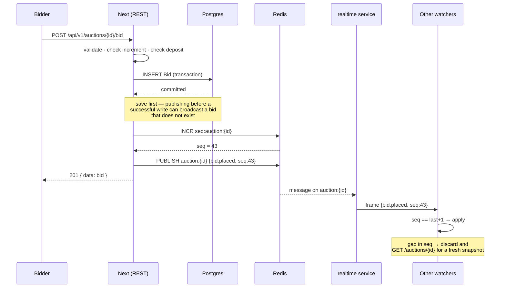

# Realtime

Live updates for auctions, offers and orders.

The service itself (`services/realtime`) is built in **task 19**. Everything
described here that lives inside Next — events, channels, the publisher — exists
now, so that no code written between task 10 and task 19 has to be retrofitted.

Why it is a separate service, and what was rejected:
[ADR 0001](adr/0001-separate-realtime-service.md).

## Shape



## The rule that governs everything

**Postgres is the truth. A realtime message is a notification that something
changed — never a source of data.**

- Never accumulate state from messages. A dropped message would become a wrong
  price on a bidder's screen, and there is no way for the client to know.
- On connect and on every reconnect: take a full snapshot from REST, *then*
  resume the stream.
- Every message carries a per-channel `seq`. A gap means the client missed
  something; it discards its stream state and takes a fresh snapshot.
- Messages are idempotent by `seq`. Receiving the same one twice changes nothing.

## Channels

| Channel | Visibility | Events |
|---|---|---|
| `auction:{id}` | public | `bid.placed` · `auction.extended` · `auction.ended` |
| `user:{id}` | owner only | `offer.received` · `offer.countered` · `offer.accepted` · `order.stage_changed` |

Names are built by `src/lib/realtime/channels.ts` and never written as strings at
a call site — a one-character typo in `auction:` produces a channel nobody
listens to, and neither review nor tests would catch it.

Authorisation is per channel. `canSubscribe()` is the single gate: auction
channels are open, `user:{id}` requires the ticket's subject to equal `{id}`.

## Payloads

Defined once in `src/lib/domain/events.ts` as Zod schemas, shared by REST, the
service and the app. The publisher validates before sending and the consumer
validates after receiving, so a malformed message cannot cross.

Payloads are identifiers and small numbers only — the client reads details from
REST.

| Event | Payload |
|---|---|
| `bid.placed` | `auctionId` · `amount` · `bidderMasked` · `bidCount` · `seq` |
| `auction.extended` | `auctionId` · `newEndsAt` · `seq` |
| `auction.ended` | `auctionId` · `result` · `seq` |
| `offer.received` / `offer.countered` | `offerId` · `listingRef` · `amount` · `seq` |
| `offer.accepted` | `offerId` · `listingRef` · `orderRef` · `seq` |
| `order.stage_changed` | `orderRef` · `stage` · `seq` |

**Never in any payload:** `reservePrice`, `minAcceptPrice`, or a full bidder
identity. `auction.ended` carries `result` as a state (`ENDED_MET` /
`ENDED_UNMET`), never a number, so the reserve cannot be inferred from it.
Names are masked to first name plus family initial — «خالد ا.» — which is enough
for the transparency the bid ledger requires and no more.

Money is a decimal **string**, never a float, even in a message.

## Authentication

> **Not implemented — built in task 19.** The protocol is settled here so the
> client code written before then targets the right shape, but the ticket
> endpoint does not exist yet: an authentication endpoint with no consumer is
> attack surface without benefit.

The session JWT is never put in a WebSocket URL — URLs end up in proxy logs,
browser history and referrers.

1. Client calls `POST /api/v1/realtime/ticket` with its normal session.
2. REST returns a short-lived, single-use ticket (60 seconds).
3. Client connects and presents the ticket in the first frame.
4. The service resolves the ticket to a user id, then applies `canSubscribe()`
   to every subscribe frame on that connection.

## Connection rules

- **One connection per client**, multiplexed by subscription. Never one socket
  per auction.
- Reconnect backoff 1s → 2s → 4s → … → 30s **with jitter**, never an immediate
  loop — a service restart must not be met with a synchronised stampede.
- Heartbeat ping/pong every 30s; a peer that misses one is dropped.
- Unsubscribe immediately on leaving a screen and on
  `visibilitychange = hidden`. No timer and no subscription runs in a hidden tab.
- Per-connection rate limit on inbound frames, and a cap on subscriptions per
  client.

## When it breaks

Realtime failing must never break the site.

- **Publish fails** (Redis down or unreachable): the write already succeeded, so
  nothing is lost. `publish()` logs and returns `{ published: false }` — it never
  throws and never fails the request.
- **Service down or socket dead**: the page falls back to polling REST every 10
  seconds and shows a «التحديث اللحظي متوقّف» strip, so the user knows the
  numbers are delayed rather than wrong.
- **Sequence gap**: the client takes a fresh snapshot automatically.

## Monitoring

Connection count · messages per second · delivery latency · reconnect rate — to
Sentry, and surfaced in **A11** as an integration health row like any other
provider.

## Operations

Copied into [`docs/operations/runbook.md`](../operations/runbook.md).

**Is it working?**

```bash
redis-cli -u "$REDIS_URL" PUBSUB CHANNELS 'auction:*'   # live auction channels
redis-cli -u "$REDIS_URL" GET seq:auction:<id>          # last sequence
curl -sI "$WS_URL/health"                                # service health
```

If `PUBSUB CHANNELS` is empty during a live auction, the service is not
subscribed — restart it. If `seq` is advancing but clients see nothing, the
break is between the service and the clients, not in Next.

**It is down. What now?**

Nothing urgent. Clients fall back to polling on their own and money is not at
risk — bids are written by REST, not by the socket. Restart the realtime
application in Coolify; connections re-establish with backoff. Do **not** redeploy
Next: it is not involved.

The one thing that does need attention is a live auction closing during the
outage. Closing is decided by the server from `Auction.endsAt` in Postgres, not
by any message, so the outcome is correct regardless — but bidders may not have
seen the last minute. Check `auction_events` for extensions and consider
extending manually if the outage overlapped the closing window.
