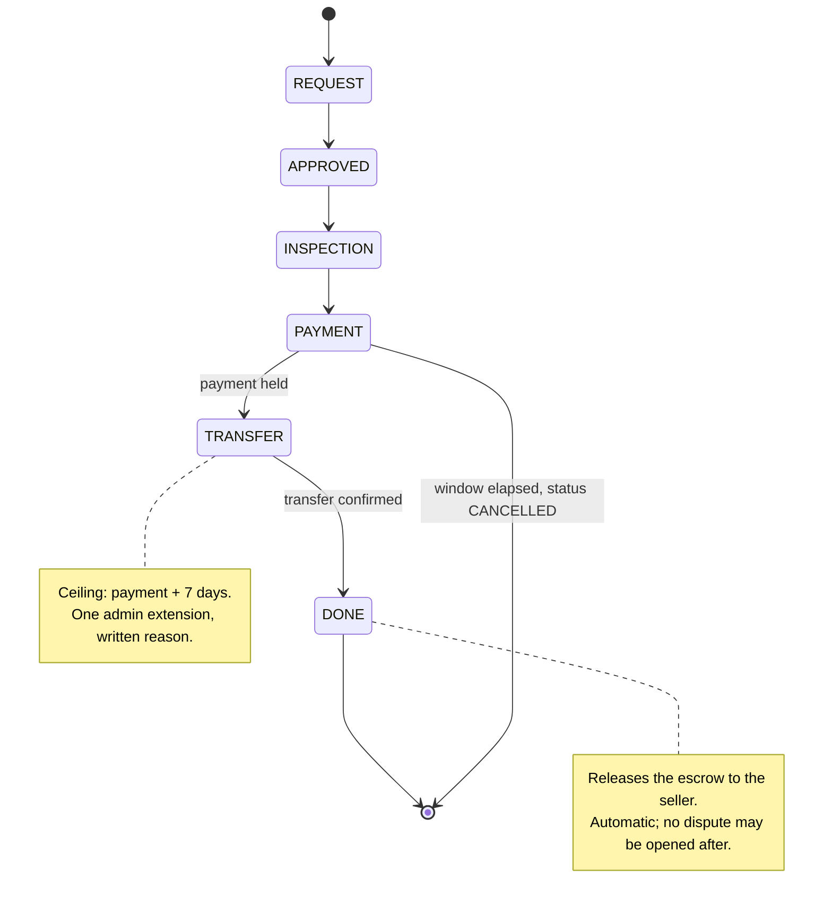
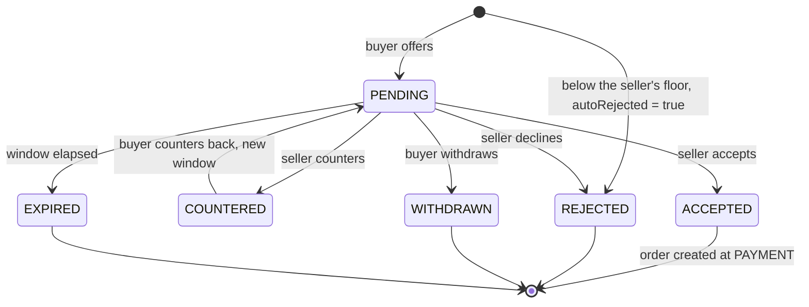
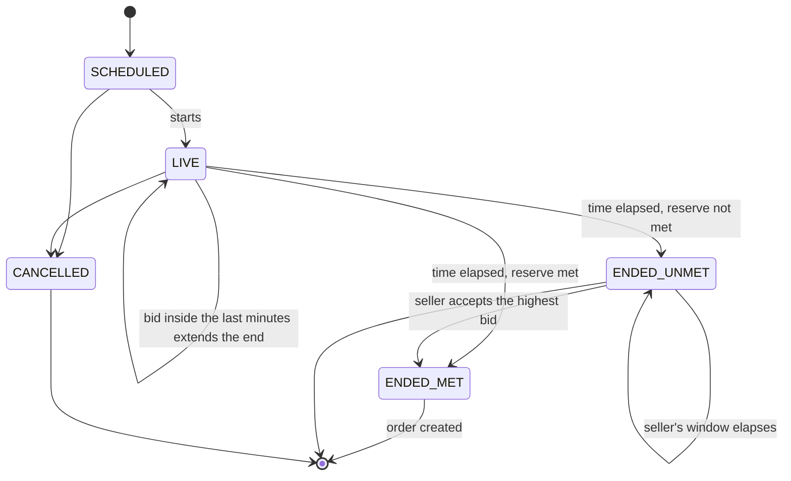
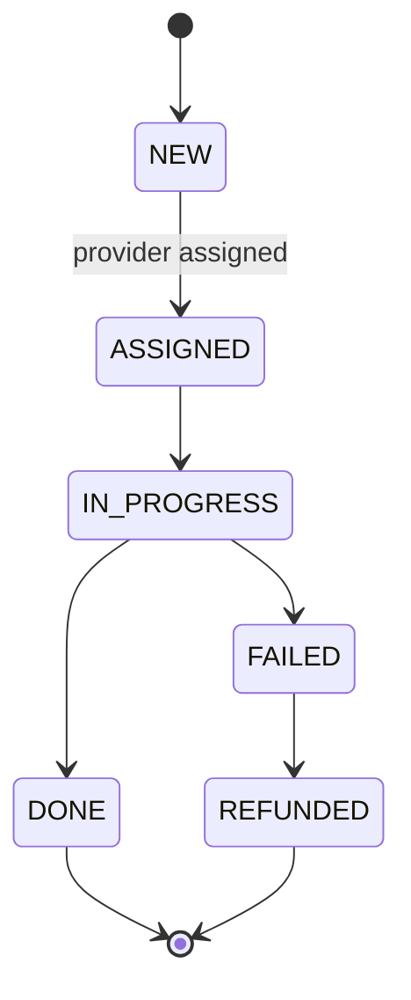
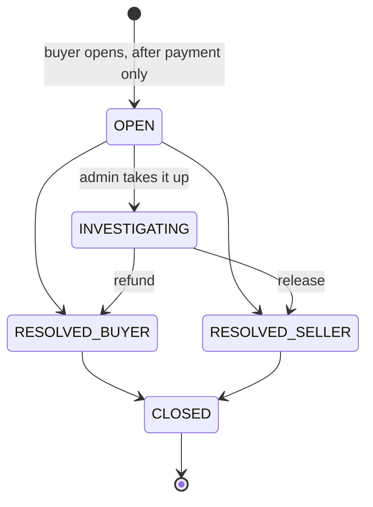
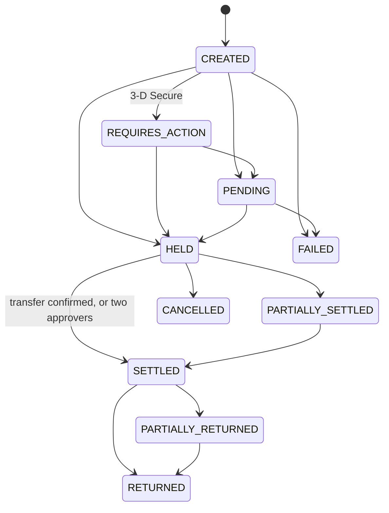
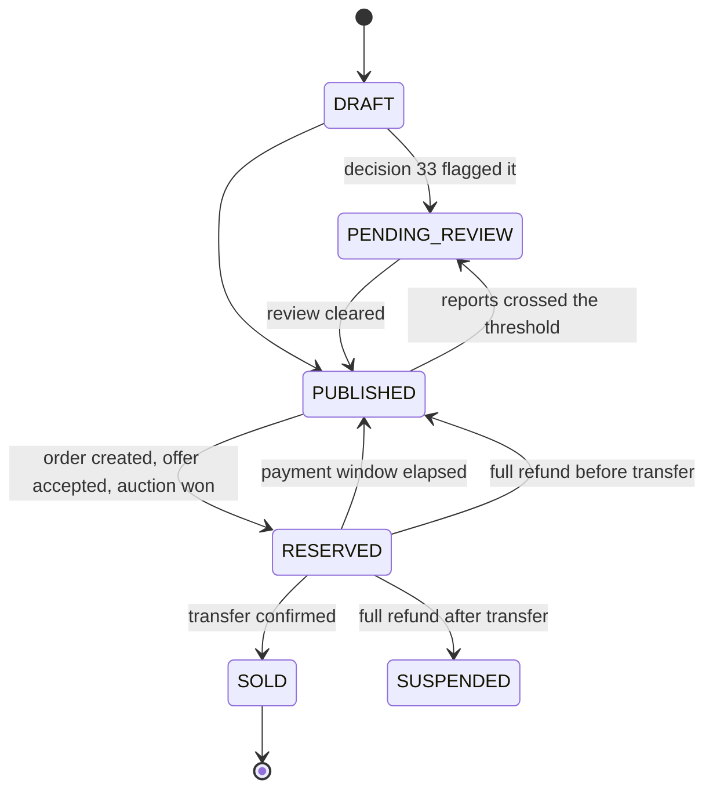

# State machines

The five paths a transaction can take. Each diagram is the shape the code
actually enforces — the transition tables are cited beside each one, so a reader
can check the drawing against the source rather than trusting it.

## 1 · Direct sale

`OrderStage` in `prisma/schema.prisma`; transitions in
`src/lib/domain/orders.ts` (`canAdvance`).

**Exactly one step forward, never back and never skipping.** `canAdvance`
compares indexes in the stage list — there is no table of allowed pairs to fall
out of step with the enum.

**Confirming the transfer releases the money.** There used to be a 7-day return
window between confirmation and release. The designer cancelled it: once the
vehicle is registered to the buyer at the traffic department the sale has
happened, and holding the money another week delays the seller against nothing.

The release is automatic — `settleOnTransferConfirmed`, called by `advanceStage`
outside its transaction, with `releaseConfirmedOrders` in the scheduler as the
safety net for a gateway that did not answer. The two-approver path stays for
exceptions.

**No quorum on the automatic path, deliberately.** A quorum guards a *person's
decision*; here the authorising event is the seller's transfer confirmation, which
is external and recorded. The audit row is written with `actorType: 'system'` and
`quorum: 'none'` so a later reader is not left to infer that someone pressed it.

**Disputes close at transfer confirmation** — `DISPUTABLE_STAGES` is `PAYMENT`
and `TRANSFER`, not `DONE`. This follows from the release: after it there is no
held money to freeze, so a full refund would be a promise with no source. A
dispute accepted and not enforceable is worse than one refused — the first is
waited on for a month before anyone discovers it was empty. The buyer inspects
before the seller confirms.

Cancellation is a **status, not a stage**: the order stays at the stage it died
in, so the record still says where it stopped.

**A dispute freezes the order in its stage.** It neither advances nor lapses
while one is open — otherwise an order reaches DONE with the dispute still live,
or lapses on the payment window and the buyer loses the right they opened it
for. `isFrozen()` in `orders.ts`.

## 2 · Negotiation

`OfferStatus`; rules in `src/lib/domain/offers.ts`.

**Auto-rejection is a flag, not a state.** The row is written directly as
`REJECTED` with `autoRejected: true` — there is no separate status, so nothing
downstream has to learn a fourth terminal state.

And it is not an error: the API answers 201 with `autoRejected: true`. An error
code would make the screen say "your offer could not be sent", which is not what
happened — the offer arrived and the seller had set a floor beneath it. The
difference decides what the buyer does next.

`ACTIVE_STATUSES` is `PENDING` and `COUNTERED`: a countered offer is still live,
and treating it as closed would let a second offer open beside it.

`minAcceptPrice` never appears in a public response.

## 3 · Auction

`AuctionStatus`; `src/lib/domain/auctions.ts`.

There is no single `ENDED`: the outcome is in the state itself
(`ENDED_MET` / `ENDED_UNMET`), so no reader has to combine a status with a
separate flag to know whether the car sold.

### The seller's window

`ENDED_UNMET` is not an ending. The seller has `sellerDecisionHours` to accept
the highest bid anyway, and accepting creates the order exactly as a met reserve
would — same amounts, same `computeOrderAmounts`. Declining, or letting the
window elapse, releases the top bidder's deposit.

An elapsed window is a **release, not a forfeit**: the bidder honoured their bid;
it was the seller who did not decide.

| actor | door |
|---|---|
| seller | `POST /api/v1/auctions/{ref}/decision` — `{ "accept": true｜false }` |
| screen | the decision panel at the top of the auction sidebar, with its countdown |
| system | `expireSellerDecisions` releases the deposit when the window elapses |

This transition was drawn in this diagram long before anything could perform it:
the domain function existed and was tested, but the only caller was the expiry
job, which always passes `false`. Every under-reserve auction therefore ended in
a refund no matter what the seller wanted. A diagram is not a door.

`reservePrice` never appears in a public response — only `reserveMet` as a
boolean. With no bids the screen shows the **opening price**, not "highest bid
0": a zero where a price belongs suggests the vehicle is worthless, which is the
worst thing a seller can read about their car.

## 4 · Service request

`ServiceRequestStatus`; `src/lib/domain/admin-services.ts`.

`FAILED` and `REFUNDED` are distinct: a service that could not be delivered is
not the same as one whose money has gone back. Collapsing them would leave no
state in which a refund is owed but not yet made.

`ServiceRequest.amount` and `adminFee` are **snapshots taken at creation**. No
query reads the price from `Service` afterwards, so changing a price cannot
disturb an open request — the protection is structural, not a discipline the
next query author has to remember.

## 5 · Dispute

`DisputeStatus`; `src/lib/domain/disputes.ts`.

Resolution moves money, so it goes through the two-approver quorum — the
`ApprovalRequest` id is stored on the dispute.

While a dispute is open the order is frozen and the payment window is paused —
`paymentPausedRemainingMs` stores what was left, so it resumes where it stopped
rather than restarting.

## 6 · Payment (crosses all of the above)

`PaymentStatus`; the transition table is `TRANSITIONS` in
`src/lib/domain/payments.ts`.

The vocabulary is **escrow, not card**: hold, settle, cancel, partialReturn.
`authorize` / `capture` / `void` exist only inside
`src/lib/payments/adapters/`, and gate 15 stops them leaking out.

**A network failure returns `PENDING`, not `FAILED`.** The request may have
arrived and executed; calling it a failure makes the domain retry and the card is
charged twice. `PENDING` leaves the decision to the webhook or to `status()`.

**Release to the seller happens on transfer confirmation** (§1). The manual
path — for exceptions — needs two approvers, `SETTLE_WINDOW_HOURS = 72`, and the
requester cannot approve their own request.

### The release had no door until now

`requestSettle`, `approveSettle`, the route, the quorum and
`tests/settle-quorum.test.ts` all existed — and **no screen in the product
called any of them**. The admin orders table was six read-only columns with no
button. Money entered escrow and there was no way to get it out to the seller.

This is the eighth instance of the same shape (payments, offers, bidding,
publishing, stage advance, disputes, auction settlement, and now this) and the
only one that holds other people's money rather than disabling a feature. Every
one of them passed hundreds of tests, because **tests never open a screen**.

`/admin/settlements` is the door. `settlementQueue()` sorts every order carrying
a held payment into three groups:

| Group | Meaning |
| --- | --- |
| Awaiting approval | A request is open — shown first, because it is what needs a person now |
| Ready | `canSettle` allows it and no request is open |
| Blocked | Not transferred, return window open, or disputed — with the reason named |

Blocked rows are shown rather than hidden. A queue that lists only what is
actionable answers "what do I do now" and not "where is this seller's money",
and the second question is the one the seller is asking.

Two details the screen gets right on purpose:

- The button says **"request release"**, not "release". The first press moves no
  money; it opens a request. A button labelled with the outcome makes an operator
  who presses it and sees nothing happen believe the system is broken.
- The eligibility shown is `canSettle` itself, not a copy. A screen that says
  "ready" while the server refuses is worse than a screen that says nothing.

## 7 · Listing (follows the order)

`ListingStatus`; every write goes through `src/lib/domain/listing-state.ts`.
Gate 21 rejects a `status:` write to `listing` anywhere else.

**A listing was never marked `SOLD`.** The order reached `DONE`, became
`COMPLETED` and issued its sale agreement, and the listing stayed `RESERVED`
forever. The admin dashboard counts `status: 'SOLD'` for sold-this-month, so it
read zero on every deployment the platform has ever had; the auctions page still
listed vehicles that had changed hands. No test failed, because no test asked
about the listing after completion.

The same shape then appeared a second time: a dispute resolved with
`FULL_REFUND` cancelled the order and left the listing reserved against an order
that no longer existed.

**Where a refunded listing goes depends on whether the vehicle moved.** Before
transfer it never left the seller, so it returns to the market. After transfer
it is with the buyer and we do not know where it settled, so publishing it would
promise what we cannot deliver — it is withdrawn instead.

> **Open:** `SUSPENDED` currently has no exit. `/account/listings` is read-only
> and there is no admin listings screen, so nothing can bring a withdrawn
> listing back. It is the most honest of the available states, not a complete
> one. Tracked as a `DESIGN-Q` in `listing-state.ts`.

**Reserving writes `closedAt` and `closeReason` too.** Three call sites used to
reserve a listing and two of them wrote neither, so some reserved rows recorded
why they closed and others did not — the difference was an incomplete copy, not
a decision. Routing every transition through one module is what makes that
impossible rather than merely unlikely.
